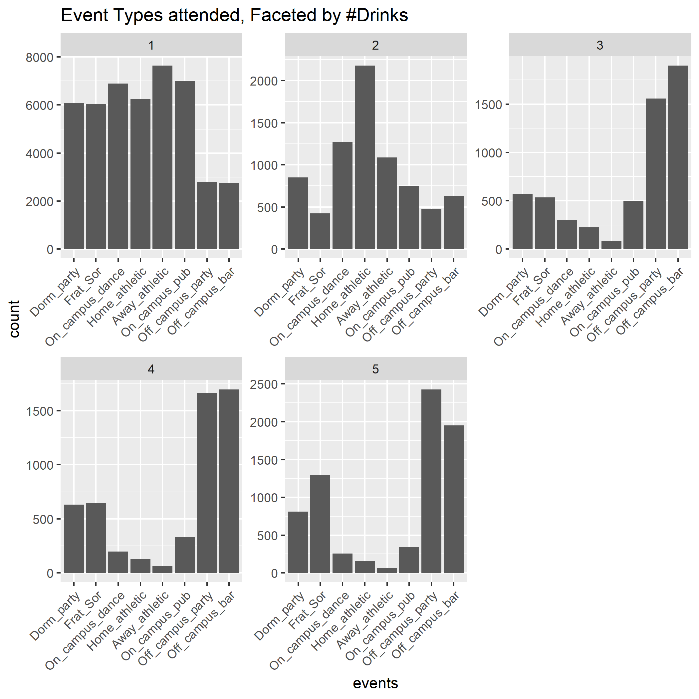
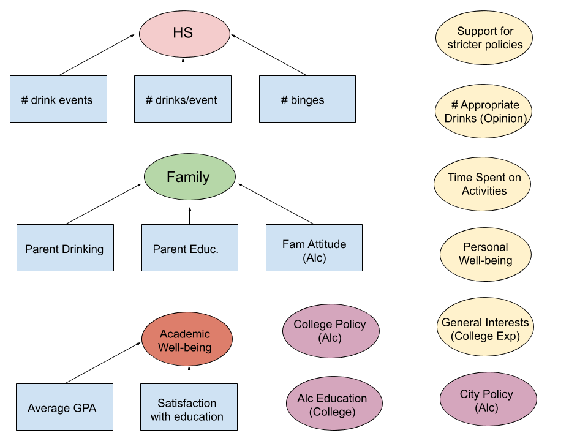
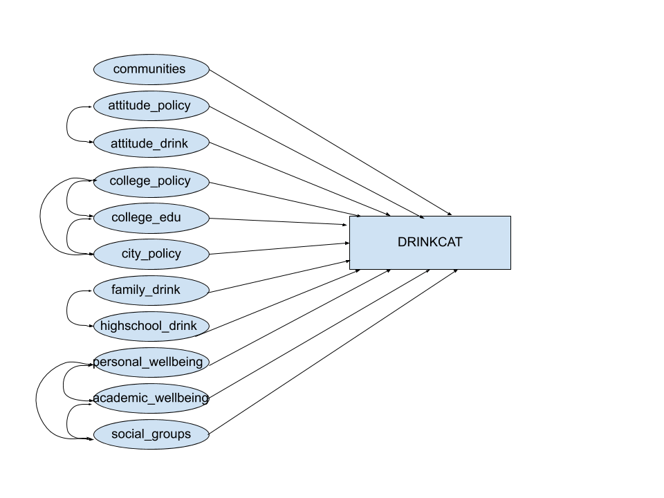
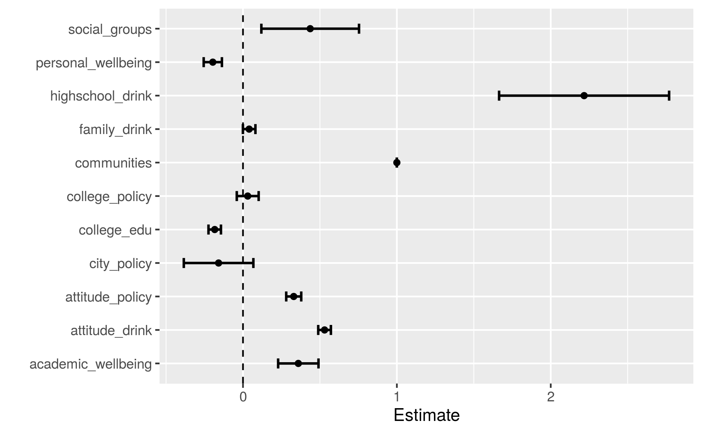
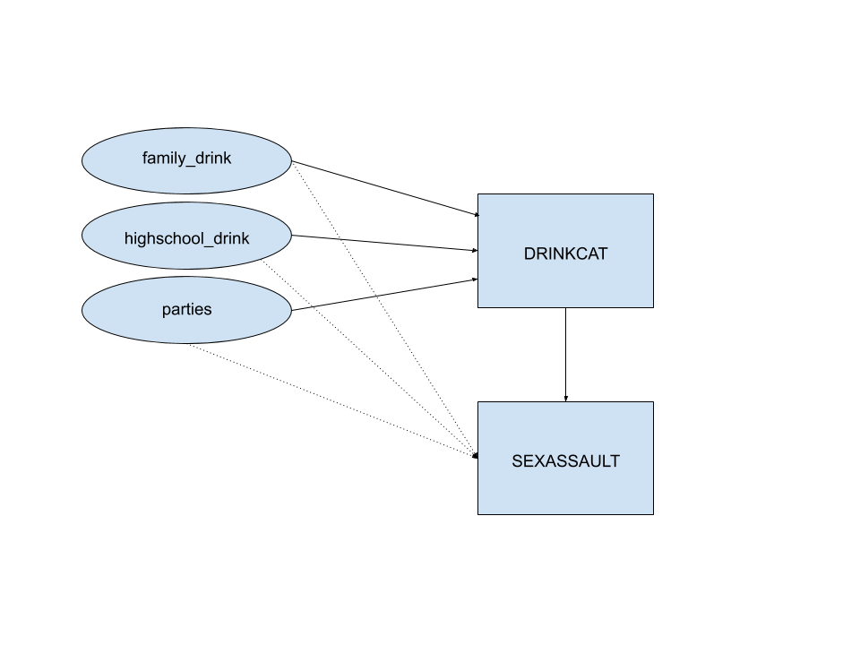

```{r setup, include=FALSE}
knitr::opts_chunk$set(echo = TRUE)
library(cowplot)
```

## Introduction 

```{r, echo = FALSE, out.width="70%" ,out.height="70%",fig.show='hold',fig.align='center'}

```

## Questions of Interest

- What factors influence college drinking behavior? 
- Relationship between drinking policies and college drinking behavior
- Relationship between college drinking behavior and sexual assault (caused by drinking)


## Data Cleaning

- Concentrated on 1997 dataset
- Used predictors from original survey questions 
- Zero-imputation for NA answers to ordinal data (if sensible)

## EDA: Drinking Habits


```{r, echo = FALSE, out.width = "250px", fig.align="center"}
knitr::include_graphics("plots/reasons_plot.png")
```

## EDA: Drinking Habits

```{r, echo = FALSE, out.width = "250px", fig.align="center"}

```


## EDA: Elastic Net 

- $\textbf{Heavy Drinking (+)}$
    - Importance of parties in college experience
    - Disruptive/loud drinking
    - Opinion on off-campus bar (# acceptable drinks)
    - \% friends who are binge drinkers
    - HS binge behavior in senior year

## Dimension Reduction

- Grouping into Latent Factors
- Factors: Correlated and Interpretable
<<<<<<< HEAD
- Ordinal covariates for each factor

## SEM
=======
    - for lavaan, latent factors must be continuous
- Ordinal predictors for each factor

## Dimension Reduction
```{r, echo=FALSE, out.width = "250px", fig.align="center"}

```


## Latent Variable Model
>>>>>>> b8b82029f5b921669a8d2659065d8d662e1bb5ed

```{r, echo = FALSE, out.width = "250px", fig.align="center"}

```

## SEM Results

```{r, echo = FALSE, out.width = "320px", fig.align="center"}
p1 <- ggdraw() + draw_image("plots/latent_communities_estimates.png")
p2 <- ggdraw() + draw_image("plots/latent_personal_estimates.png")
pp1<- plot_grid(p1, p2)
ggdraw(pp1)
```

## SEM Results

```{r, echo = FALSE, out.width = "250px", fig.align="center"}

```

## Mediation 

```{r, echo = FALSE, out.width = "250px", fig.align="center"}

```

## Mediation Results

```{r message=FALSE, echo=FALSE, out.width = "330px",fig.align = "center"}
p1 <- ggdraw() + draw_image("plots/mediation_others_2.png")
p2 <- ggdraw() + draw_image("plots/mediation_self_2.png")
pp1<- plot_grid(p1, p2, align = "v")
ggdraw(pp1)
```

## Discussion and Future Work 

- Influential Factors: 
  * High high school drinking habits is associated with increased college drinking behavior
  * Worse academic well-being is associated with increased college drinking, while better personal wellbeing is associated with a decrease in college drinking
- Policies: 
  * Both school and local policies did not have a significant effect on college drinking behavior
  * Less education material on drinking is associated with less drinking 
- Sexual Assault: 
  * High school drinking habits alone and through mediator contributes the most to incidences of sexual assault
- We assume linearity and normality in our models, so in the future we want to extend to non-parametric models with SEM 
