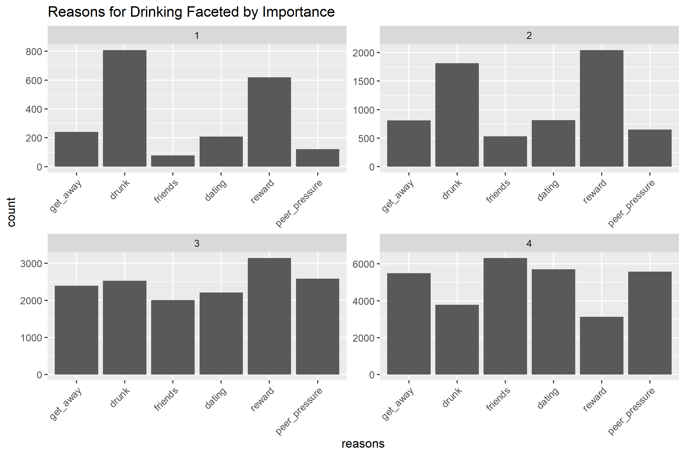

```{r setup, include=FALSE}
knitr::opts_chunk$set(echo = TRUE)
```

## Introduction

## Data Cleaning

- Indicator Variables for NA answers to categorical data
- Zero-imputation for NA answers to ordinal data (if sensible)

## EDA: Drinking Habits


```{r, echo = FALSE, out.width = "250px", fig.align="center"}

```


## EDA: Elastic Net 

- $\textbf{Heavy Drinking (+)}$
    - Importance of parties in college experience
    - Disruptive/loud drinking
    - Opinion on off-campus bar (# acceptable drinks)
    - \% friends who are binge drinkers
    - HS binge behavior in senior year

## Dimension Reduction

- Grouping into Latent Factors
- Factors: Correlated and Interpretable
- Ordinal covariates for each factor

## Latent Variable Model

```{r, echo = FALSE, out.width = "250px", fig.align="center"}

```

## SEM 

```{r, echo = FALSE, out.width = "250px", fig.align="center"}

```


## Discussion