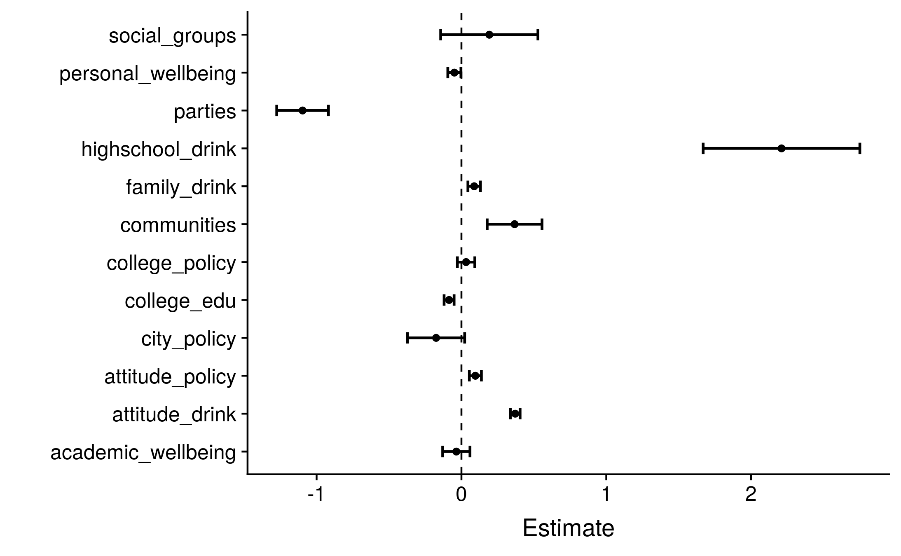

```{r setup, include=FALSE}
knitr::opts_chunk$set(echo = TRUE)
library(cowplot)
```

## Introduction

## Data Cleaning

- Indicator Variables for NA answers to categorical data
- Zero-imputation for NA answers to ordinal data (if sensible)

## EDA: Drinking Habits


```{r, echo = FALSE, out.width = "250px", fig.align="center"}
knitr::include_graphics("plots/reasons_plot.png")
```


## EDA: Elastic Net 

- $\textbf{Heavy Drinking (+)}$
    - Importance of parties in college experience
    - Disruptive/loud drinking
    - Opinion on off-campus bar (# acceptable drinks)
    - \% friends who are binge drinkers
    - HS binge behavior in senior year

## Dimension Reduction

- Grouping into Latent Factors
- Factors: Correlated and Interpretable
- Ordinal covariates for each factor

## SEM

```{r, echo = FALSE, out.width = "250px", fig.align="center"}
knitr::include_graphics("plots/latent_variable_model.png")
```

## SEM Results

```{r, echo = FALSE, out.width = "320px", fig.align="center"}
p1 <- ggdraw() + draw_image("plots/latent_communities_estimates.png")
p2 <- ggdraw() + draw_image("plots/latent_personal_estimates.png")
pp1<- plot_grid(p1, p2)
ggdraw(pp1)
```

## SEM Results

```{r, echo = FALSE, out.width = "250px", fig.align="center"}

```

## Mediation 

```{r, echo = FALSE, out.width = "250px", fig.align="center"}
knitr::include_graphics("plots/mediation_analysis.png")
```

## Mediation Results

```{r message=FALSE, echo=FALSE, out.width = "330px",fig.align = "center"}
p1 <- ggdraw() + draw_image("plots/mediation_others_2.png")
p2 <- ggdraw() + draw_image("plots/mediation_self_2.png")
pp1<- plot_grid(p1, p2, align = "v")
ggdraw(pp1)
```

## Discussion