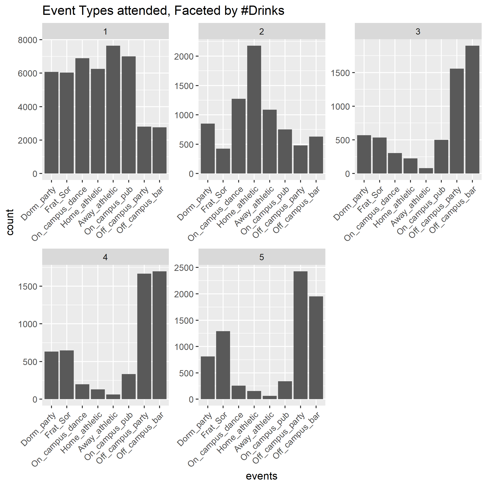
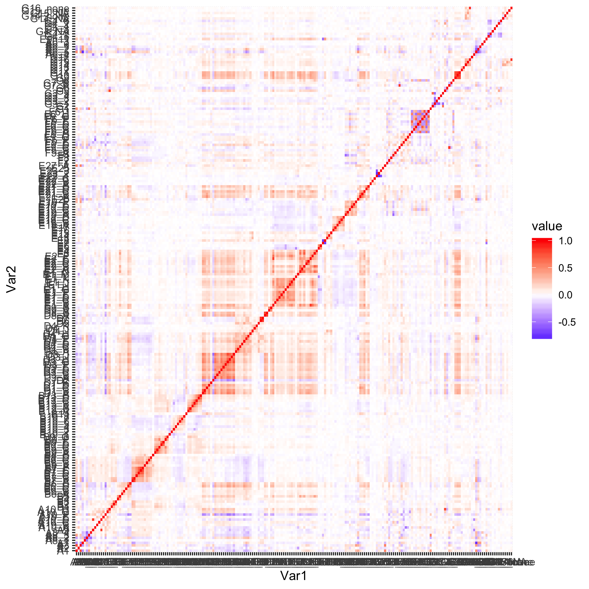

```{r setup, include=FALSE}
knitr::opts_chunk$set(echo = TRUE,eval=FALSE)
suppressMessages(library(kableExtra))
suppressMessages(library("tidyverse"))
library(tidyverse)
library(glmnet)
library(lavaan)
```


## Appendix

### Elastic Net Model
The most important predictors for heavy drinkers: A10_F(parties, neg), B6_D (drinking group which was asked to be quieter/less disruptive, positive), D1_B (opinion on appropriate amount for off-campus bar drinking, pos), D9_B (percentage of friends who are binge drinkers, pos), G11 (HS number of binges, pos)

```{r, echo = FALSE}
cas97_glm<-cas97 %>% dplyr::select(grep("^B8_B$|^B8_C$|^B12_A$|^B7_A$|^B7_B$|^B7_C$|^B7_D$|^B7_E$|^B7_F$|^B8_D$|^B12_B$|^B9_C$|^B9_G$|^B1$|^B6_A$|^B6_B$|^B9_A$|^B9_D$|^B9_E$|^B9_F$|^B13_A$|^B13_B$|^B9_B$|^B11$|^B6_E$|^B6_C$|^B13_E$|^B2$|^B3$|^B13_C$|^B13_D$|^B6_D$|^F5_A|^F5_B|^F5_C|^F5_D|^F5_E|^F5_F|^F5_G|^F5_H|^F6_A|^F6_B|^F6_C|^F6_D|^F6_E|^F6_E|^F6_F|^F6_G|^F6_H|^F6_I|^F1|^F4|^F2|^F3|^G2|^G3|^G4|^G9|^G10|^G11|^G15|^G14|^G16|^G17|^G13|^A8|^D2|^D8|^D9|^D3|^D1|^A9|^A10|^DRINKCAT",colnames(.))) %>%
  mutate_all(function(x) scale(as.numeric(x))) %>%
  mutate(DRINKCAT=case_when(DRINKCAT<=1 ~ "light",
                            DRINKCAT<=3 ~ "heavy")) %>%
  mutate(DRINKCAT=as.factor(DRINKCAT)) %>%
  drop_na()

naive_elastic<-cv.glmnet(x=cas97_glm %>%
                         dplyr::select(-DRINKCAT) %>% 
                         mutate_each(as.numeric) %>% 
                         as.matrix(), 
                      y=cas97_glm %>% 
                        dplyr::select(DRINKCAT) %>% 
                        mutate_each(as.factor) %>% 
                        as.matrix(),
                      family="multinomial")

coef(naive_elastic)

#
```

```{r num-drinks-eda, echo=FALSE, eval=TRUE,out.width = "300px", fig.align="center", fig.pos = "h", fig.cap="\\label{fig:num-drinks-eda}The figure shows the number of students attending certain events, faceted by number of drinks had at an event."}

```


```{r reasons-eda, echo=FALSE, eval=TRUE,out.width = "500px", fig.align="center", fig.cap="\\label{fig:latent-vars}The figure shows the reasons why students say they drink, faceted by importance (very important=1)."}
knitr::include_graphics("plots/reasons_plot.png")
```


```{r latent-vars, echo=FALSE, eval=TRUE,out.width = "300px", fig.align="center",fig.pos="h", fig.cap="\\label{fig:latent-vars}Figure shows latent factors (ovals) in the SEM for drinking behaviors. Squares show summary of actual questions in the survey."}
knitr::include_graphics("plots/latent_vars.png")
```


```{r, echo=FALSE, eval=TRUE,out.width = "300px", fig.align="center",fig.pos="h", fig.cap="\\label{fig:path-sem}Figure shows path diagram of SEM on risk factors for heavy drinking behaviors in college."}
knitr::include_graphics("plots/latent_variable_model.png")
```

```{r, echo=FALSE, eval=TRUE,out.width = "300px", fig.align="center",fig.pos="h", fig.cap="\\label{fig:path-med}Figure shows path diagram of mediation model for the indirect effects of family, high school drinking behaviors and parties on risk of sexual assault."}
knitr::include_graphics("plots/mediation_analysis.png")
```


```{r loading_table, eval=TRUE, echo=FALSE}
suppressMessages(library(xtable))
full_coefs <- readRDS("table/full_estimates.rds")
```

\newpage

```{r, eval=TRUE, echo=FALSE, results='asis', fig.align = "center",fig.pos="h"}
knitr::kable(full_coefs %>% 
               filter(op == "~") %>%
               mutate(latent_var = rhs, est = round(est, 2), p_value = round(pvalue, 2),
                      ci_lower = round(ci.lower, 2), ci_upper = round(ci.upper, 2)) %>%
               select(latent_var, est, ci_lower, ci_upper, p_value),
             align = "c",
             caption = "\\label{tab:full-coefs}Estimates and 95 percent confident intervals of latent factors in the SEM for levels of drinking. High school drinking, support of more lenient drinking policy, importance of parties (parties), less exposure to alcohol education, family drinks, and personal wellbeing are associated with more drinking in college")
```


```{r, eval=TRUE, echo=FALSE, results='asis', fig.align="center", fig.pos="h"}
knitr::kable(full_coefs %>% 
               filter(op == "=~" & lhs %in% c("highschool_drink", "parties", "communities", "attitude_drink")) %>%
               mutate(latent_var = lhs, survey_question = rhs, est = round(est, 2), p_value = round(pvalue, 2),
                      ci_lower = round(ci.lower, 2), ci_upper = round(ci.upper, 2)) %>%
               select(latent_var, survey_question, est, ci_lower, ci_upper, p_value),
             align = "c",
             caption = "\\label{tab:load-coefs}Loadings of survey questions for latent factors.")
```

```{r, results='asis', eval=TRUE, echo=FALSE, fig.align = "center",fig.pos="h"}
medvictim_coef <- readRDS("table/med_them_estimates.rds")
knitr::kable(medvictim_coef %>% 
               filter(op == ":=") %>%
               separate(label, c("type", "vars")) %>%
               mutate(effect_type = type, latent_var = vars, est = round(est, 2), p_value = round(pvalue, 2),
                      ci_lower = round(ci.lower, 2), ci_upper = round(ci.upper, 2)) %>%
               select(latent_var, effect_type, est, ci_lower, ci_upper, p_value),
             align = "c",
             caption = "\\label{tab:medvictim-coefs}Direct and indirect effects of latent factors on risk of sexual assault when victim was drinking.")
```

```{r, eval=TRUE, echo=FALSE, results='asis', fig.align = "center", fig.pos="h"}
medass_coef <- readRDS("table/med_others_estimates.rds")
knitr::kable(medass_coef %>% 
               filter(op == ":=") %>%
               separate(label, c("type", "vars")) %>%
               mutate(effect_type = type, latent_var = vars, est = round(est, 2), p_value = round(pvalue, 2),
                      ci_lower = round(ci.lower, 2), ci_upper = round(ci.upper, 2)) %>%
               select(latent_var, effect_type, est, ci_lower, ci_upper, p_value),
             align = "c", 
             caption = "\\label{tab:medass-coefs}Direct and indirect effects of latent factors on risk of sexual assault when assaulter was drinking.")
```

\newpage

Below are tables of the estimates for the following three models
$$
\begin{aligned}
\text{SEXASSAULT} &\sim \text{communities} + \text{family$\_$drink} + \text{highschool$\_$drink} \\
\text{DRINKCAT} &\sim \text{communities} + \text{family$\_$drink} + \text{highschool$\_$drink} \\
\text{SEXASSAULT} &\sim \text{DRINKCAT}
\end{aligned}
$$

```{r, results='asis', eval=TRUE, echo=FALSE, fig.pos="h"}
knitr::kable(medass_coef %>% 
               head(7) %>%
               mutate(response = recode(lhs, "SEXASSAULT_others" = "SEXASSAULT"), 
                      latent_var = rhs, 
                      est = round(est, 2), p_value = round(pvalue, 2),
                      ci_lower = round(ci.lower, 2), ci_upper = round(ci.upper, 2)) %>%
               select(response, latent_var, est, ci_lower, ci_upper, p_value),
             align = "c",
             caption = "\\label{tab:indir2-coefs}Coefficient estimates of the three models. The response is indicator of sexual assault when the assaulter was drinking.")
```


```{r, results='asis', eval=TRUE, echo=FALSE, fig.pos="h"}
knitr::kable(medvictim_coef %>% 
               head(7) %>%
               mutate(response = recode(lhs, "SEXASSAULT_them" = "SEXASSAULT"), 
                      latent_var = rhs, 
                      est = round(est, 2), p_value = round(pvalue, 2),
                      ci_lower = round(ci.lower, 2), ci_upper = round(ci.upper, 2)) %>%
               select(response, latent_var, est, ci_lower, ci_upper, p_value),
             align = "c",
             caption = "\\label{tab:indir-coefs}Coefficient estimates of the three models. The response is indicator of sexual assault when the victim was drinking.")
```

```{r load_data, include = FALSE, cache=TRUE}
### Reading In Data
### Split file by number of columns for each variable in Record_layout.txt file. Spaces are missing values.
read_cas <- function(folder, file, recordfile) {
  skip <- grep("--------", readLines(unz(folder, recordfile)))
  record_layout <- read.table(unz(folder, recordfile), 
                            fill = TRUE, skip = skip, header = FALSE)
  colnames(record_layout) <- c("variable_name", "start_col", "end_col", "type")
  record_layout <- record_layout %>% filter(!is.na(end_col))
  widths <- as.numeric(as.character(record_layout$end_col)) - as.numeric(as.character(record_layout$start_col)) + 1
  cas <- read.fwf(unz(folder, file), widths = widths, header	= FALSE,
                  col.names = record_layout$variable_name)
  return(cas)
}
cas97 <- read_cas(folder = "Harvard_CAS_1997.zip", 
                  file = "Harvard_CAS_1997/DS0001/03163-0001-Data.txt",
                  recordfile = "Harvard_CAS_1997/DS0001/03163-0001-Record_layout.txt")
```


```{r summary_na_function, include = FALSE}
summary_na<-function(df) {
  na_count <- colSums(apply(df, 2, is.na))
  data.frame(name = colnames(df), na_pct = na_count/nrow(df)) %>% arrange(desc(na_pct))
}
```


```{r section_a, include = FALSE}
#### Section A
# See which vars have lots of NA's
# The survey asks students to skip some questions on purpose. We manually go through the survey to impute these values and drop remaining missing entries.
cas97 %>% 
  dplyr::select(which(grepl("^A", colnames(.)))) %>%
  summary_na()

# Fill in NA's that mean 0
cas97 <- cas97 %>%
  mutate(A8_answered = cas97 %>%
                        dplyr::select(which(grepl("^A8_", colnames(.)))) %>%
                        rowSums(na.rm = TRUE)) %>%
  mutate(A8_1 = ifelse(is.na(A8_1) & A8_answered > 0, 0, A8_1),
         A8_2 = ifelse(is.na(A8_2) & A8_answered > 0, 0, A8_2),
         A8_3 = ifelse(is.na(A8_3) & A8_answered > 0, 0, A8_3),
         A8_4 = ifelse(is.na(A8_4) & A8_answered > 0, 0, A8_4)) %>%
  # A6 should be dummified
  mutate(ones = 1) %>%
  tidyr::pivot_wider(names_from = A6, 
                     values_from = ones, 
                     values_fill = list(ones = 0), 
                     names_prefix = "A6_") %>%
  # Some NA in A7 means student lived off campus
  mutate(A7 = ifelse(is.na(A7) & A6_5 == 1, 0, A7)) %>%
  # Drop A4, A5 that are transfer questions, otherwise have to dummify
  dplyr::select(-A4, -A5, -A8_answered, -A8)

# How many complete cases left?
cas97 %>%
  dplyr::select(which(grepl("^A", colnames(.)))) %>%
  filter(complete.cases(.)) %>%
  nrow()
```


```{r section_b, include = FALSE}
#### Section B

#No skipped questions

#For B10, an indicator is an option, fill in zero for than NA
# Which columns in this section have lots of NA?
cas97 %>% 
  dplyr::select(which(grepl("^B", colnames(.)))) %>%
  summary_na()

# Fill in NA that actually means 0
cas97 <- cas97 %>%
  mutate(B10_answered = cas97 %>%
                        dplyr::select(which(grepl("^B10_", colnames(.)))) %>%
                        rowSums(na.rm = TRUE)) %>%
  mutate(B10_1 = ifelse(is.na(B10_1) & B10_answered > 0, 0, B10_1),
         B10_2 = ifelse(is.na(B10_2) & B10_answered > 0, 0, B10_2),
         B10_3 = ifelse(is.na(B10_3) & B10_answered > 0, 0, B10_3),
         B10_4 = ifelse(is.na(B10_4) & B10_answered > 0, 0, B10_4),
         B10_5 = ifelse(is.na(B10_5) & B10_answered > 0, 0, B10_5),
         B10_6 = ifelse(is.na(B10_6) & B10_answered > 0, 0, B10_6),
         B10_7 = ifelse(is.na(B10_7) & B10_answered > 0, 0, B10_7),
         B10_8 = ifelse(is.na(B10_8) & B10_answered > 0, 0, B10_8)) %>%
  dplyr::select(-B10_answered)

# How many complete cases left?
cas97 %>%
  dplyr::select(which(grepl("^B", colnames(.)))) %>%
  filter(complete.cases(.)) %>%
  nrow()
```


```{r section_d, include = FALSE}
#### Section D
# Which columns in this section have lots of NA?
cas97 %>% 
  dplyr::select(which(grepl("^D\\d", colnames(.)))) %>%
  summary_na()

cas97 <- cas97 %>%
  dplyr::select(-D7_1, -D7_2, -D7_3, -D7_4)

# How many complete cases left?
cas97 %>%
  dplyr::select(which(grepl("^D\\d", colnames(.)))) %>%
  filter(complete.cases(.)) %>%
  nrow()
```


```{r section_e, include = FALSE}
#### Section E

#Possible groups to consider: Female vs Male, Younger vs Older than 21 years old
# Which columns in this section have lots of NA?
cas97 %>% 
  dplyr::select(which(grepl("^E\\d", colnames(.)))) %>%
  summary_na()

cas97 <- cas97 %>%
  # Fill NA resulted from dummifying vars E23
  mutate(E23_answered = cas97 %>%
                        dplyr::select(which(grepl("^E23_", colnames(.)))) %>%
                        rowSums(na.rm = TRUE)) %>%
  mutate(E23_1 = ifelse(is.na(E23_1) & E23_answered > 0, 0, E23_1),
         E23_2 = ifelse(is.na(E23_2) & E23_answered > 0, 0, E23_2),
         E23_3 = ifelse(is.na(E23_3) & E23_answered > 0, 0, E23_3)) %>%
  # Fill E27 with 0 for people less than 21 years old
  mutate(E27_A = ifelse(is.na(E27_A) & AGELT21 == 1, 0, E27_A)) %>%
  dplyr::select(-E27_B, -E27_C) %>%
  # Combine E24, 25, 26: Did you get seriously injured within 6 hours of drinking: fill 0 in NA E25
  replace_na(list(E25 = 0)) %>%
  # E10-12 skipped if never had sex. Can combine E9 and E11, drop E10, E12
  mutate(E9n11 = ifelse(is.na(E11) & E9 == 1, 0, E11 + 1)) %>%
  dplyr::select(-E9, -E10, -E12, -E11) %>%
  # E13-15 skipped if male
  replace_na(list(E13 = 0, E14 = 0, E15 = 0)) %>%
    #mutate(sex_assualt = ifelse(D4_H > 1 | D4_I > 1 | E15 > 1,max(D4_H,D4_I,E15, na.rm = TRUE), 1))
  dplyr::select(-E24, -E26, -E23_answered, -E23) %>%
  #create sexual assault due to drinking variable
  mutate(sex_assualt_ind = ifelse(D4_H > 1 | D4_I > 1 | E15 > 0, 1, 0))

```


```{r section_f, include = FALSE}
#### Section F
# Which columns in this section have lots of NA?
cas97 %>% 
  dplyr::select(which(grepl("^F", colnames(.)))) %>%
  summary_na()

# Remove F70/30FRND
cas97 <- cas97 %>%
  dplyr::select(-F70FRND, -F30FRND)
```


```{r section_g, include = FALSE}
#### Section G
cas97 <- cas97 %>% 
  mutate(G3_answered = cas97 %>%
                        dplyr::select(which(grepl("^G3_", colnames(.)))) %>%
                        rowSums(na.rm = TRUE)) %>%
  mutate(G3_1 = ifelse(is.na(G3_1) & G3_answered > 0, 0, G3_1),
         G3_2 = ifelse(is.na(G3_2) & G3_answered > 0, 0, G3_2),
         G3_3 = ifelse(is.na(G3_3) & G3_answered > 0, 0, G3_3),
         G3_4 = ifelse(is.na(G3_4) & G3_answered > 0, 0, G3_4),
         G3_5 = ifelse(is.na(G3_5) & G3_answered > 0, 0, G3_5),
         ) %>%
  dplyr::select(-G3_answered, -G3) %>%
  mutate(ones=1) %>%
  pivot_wider(names_from = G4,
              values_from = ones,
              values_fill = list(ones=0),
              names_prefix = "G4_") %>%  #indicators for religion
  mutate(G14_NA = as.numeric(G14==5),
         G14_none = as.numeric(G14==6),
         G15_NA = as.numeric(G15==5),
         G15_none = as.numeric(G15==6)) %>% #indicators for don't know/NA, parental drinking
  #indicator for no family agreement about drinking
  mutate(G16_none=as.numeric(G16==4)) %>%
  # Change "I don't know" into 0
  mutate(G14 = ifelse(G14 == 8, 0, G14),
         G15 = ifelse(G14 == 8, 0, G15),
         G16 = ifelse(G16 == 1, 0, G16),
         G16 = ifelse(G16 == 4, 1, G16)
         )
# Which columns in this section have lots of NA?
cas97 %>% 
  dplyr::select(which(grepl("^G\\d", colnames(.)))) %>%
  summary_na()
```


```{r check_complete_case, include = FALSE}
#Here we check for the number of complete cases after the preprocessing step above:
cas97 %>%
  dplyr::select(which(grepl("^[[:upper:]]\\d", colnames(.)))) %>%
  dplyr::select(which(!grepl("^C\\d", colnames(.)))) %>% # Remove Section C for now
  filter(complete.cases(.)) %>%
  dim()
```


```{r drinkcat_missingness, include = FALSE}

#We only have about 7100 observations for 212 variables 
#There are few missing values for the response DRINKCAT

mean(is.na(cas97$DRINKCAT))

```

```{r corr matrix, include = FALSE, eval = FALSE}

#### Multicolinearity
cas97_noc <- cas97 %>%
  dplyr::select(which(grepl("^[[:upper:]]\\d", colnames(.)))) %>%
  dplyr::select(which(!grepl("^C\\d", colnames(.)))) %>% # Remove Section C for now
  filter(complete.cases(.)) %>%
  dplyr::select(-A6_NA)
#sort(apply(cas97_noc, 2 , sd))
#Drop A6_NA in complete cases, because the standard deviation is 0 and we also check the correlation between the variables
plot_cormat <- function(X) {
  cormat <- round(cor(X), 2)
  melted_cormat <- reshape2::melt(cormat)
  ggplot(data = melted_cormat, aes(x=Var1, y=Var2, fill=value)) + 
  geom_tile() + scale_fill_gradient2(low = "blue", mid = "white", high = "red")
  ggsave("plots/corr_matrix.png")
}

plot_cormat(cas97_noc)
```

```{r corr_matrix_output, echo = FALSE, eval = TRUE, fig.pos = "h",out.width = "300px", fig.align="center", fig.cap="\\label{fig:corr_matrix} Correlations between Survey Questions."}


```


```{r corr dist, echo = FALSE, fig.cap="Histogram of Correlations"}
cormat <- round(cor(cas97_noc), 2)
covvec <- cormat[upper.tri(cormat, diag = FALSE)]
hist(covvec, breaks = 50)
#reshape2::melt(cormat) %>%
#  filter(Var1 != Var2) %>%
#  arrange(value)

check_cor <- function(df, desc = FALSE) {
  cormat <- round(cor(df), 2)
  if (desc) {
    reshape2::melt(cormat) %>%
    filter(Var1 != Var2) %>%
    arrange(desc(value))
  } else {
    reshape2::melt(cormat) %>%
    filter(Var1 != Var2) %>%
    arrange(value)
  }
} 
```

