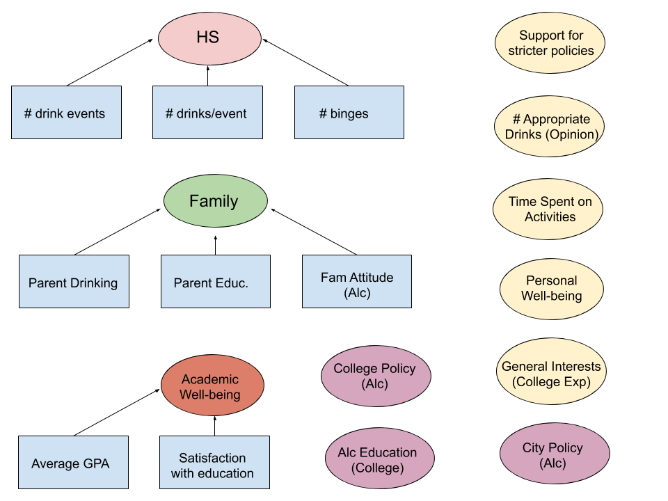

```{r setup, include=FALSE}
knitr::opts_chunk$set(echo = TRUE,eval=FALSE)
```

## Data Cleaning

Due to the structure of the survey (students skip certain questions based on their answers), there are a lot of missing values induced in the data for certain variables. We impute zero values for NAs if the variables are ordinal and if NAs are naturally lowest in the ordinal structure. Otherwise, we create indicator variables for whether a person answered NA or not for each variable in question. We additionally drop true missing values and use complete cases in this analysis.

## Exploratory Data Analysis

We look at drinking patterns casually by visualizing some survey question responses from Section C, which is about drinking patterns in college. By looking at histograms, we can see that drinking at off-campus parties and bars results in the highest number of drinks taken. The reasons students cited as most important for drinking were getting drunk and as a reward. This suggests that location and blahblah

## Methods

We create the following latent factors from existing survey question variables. Since these factors must be correlated, interpretable, and continuous (due to our use of the $\texttt{lavaan}$ package), we ensure that the survey question variables included in each factor are uniformly ordinal in an interpretable way. Our two factors related to students' pre-college lives are Family Education/Drinking (G14,G15) and High School Drinking Behavior (G9-11). The external-policy related factors are College Alcohol Policy, College Alcohol Education, and City Alcohol Policy. The rest of the latent factors have to do with students' college experiences and opinions: Academic Wellbeing, Personal Wellbeing, Support for Stricter Policies, Opinions on # Appropriate Drinks, Time Spent on Activities, and General Interests (for College Experience).

In order to understand the relationships between drinking behaviors and sexual assault, we fit another latent factor model with mediation on the indicator of being a victim of sexual assault given family education/drinking background, high school, college drinking behavior, and participations in parties. Mediation analysis allows us to estimate how much of the association between a risk factor, such as participation in parties, and the risk of sexual assault is mediated by the victim's drinking behavior.

## Results

Table FILL IN ## shows the latent variables' coefficents estimates and 95\% confidence interval for the drinking behavior model.

## Sensitivity Analysis

We can compare our latent factor models to an elastic net model created using the $\texttt{glmnet}$ package. 


## Figures

```{r, echo=FALSE, eval=TRUE,out.width = "500px", fig.align="center"}

```

## Appendix

## Data Cleaning

### Reading In Data

Split file by number of columns for each variable in Record_layout.txt file. Spaces are missing values.

```{r load_data, cache=TRUE}
read_cas <- function(folder, file, recordfile) {
  skip <- grep("--------", readLines(unz(folder, recordfile)))
  record_layout <- read.table(unz(folder, recordfile), 
                            fill = TRUE, skip = skip, header = FALSE)
  colnames(record_layout) <- c("variable_name", "start_col", "end_col", "type")
  record_layout <- record_layout %>% filter(!is.na(end_col))
  widths <- as.numeric(as.character(record_layout$end_col)) - as.numeric(as.character(record_layout$start_col)) + 1
  cas <- read.fwf(unz(folder, file), widths = widths, header	= FALSE,
                  col.names = record_layout$variable_name)
  return(cas)
}
# cas93 <- read_cas(folder = "Harvard_CAS_1993.zip", 
#                   file = "Harvard_CAS_1993/DS0001/06577-0001-Data.txt",
#                   recordfile = "Harvard_CAS_1993/DS0001/06577-0001-Record_layout.txt")
cas97 <- read_cas(folder = "Harvard_CAS_1997.zip", 
                  file = "Harvard_CAS_1997/DS0001/03163-0001-Data.txt",
                  recordfile = "Harvard_CAS_1997/DS0001/03163-0001-Record_layout.txt")
# cas99 <- read_cas(folder = "Harvard_CAS_1999.zip", 
#                   file = "Harvard_CAS_1999/DS0001/03818-0001-Data.txt",
#                   recordfile = "Harvard_CAS_1999/DS0001/03818-0001-Record_layout.txt")
# cas20 <- read_cas(folder = "Harvard_CAS_2001.zip", 
#                   file = "Harvard_CAS_2001/DS0001/04291-0001-Data.txt",
#                   recordfile = "Harvard_CAS_2001/DS0001/04291-0001-Record_layout.txt")
```


```{r}
summary_na<-function(df) {
  na_count <- colSums(apply(df, 2, is.na))
  data.frame(name = colnames(df), na_pct = na_count/nrow(df)) %>% arrange(desc(na_pct))
}
```


The survey asks students to skip some questions on purpose. We manually go through the survey to impute these values and drop remaining missing entries.

#### Section A

```{r}
# See which vars have lots of NA's
cas97 %>% 
  dplyr::select(which(grepl("^A", colnames(.)))) %>%
  summary_na()

# Fill in NA's that mean 0
cas97 <- cas97 %>%
  mutate(A8_answered = cas97 %>%
                        dplyr::select(which(grepl("^A8_", colnames(.)))) %>%
                        rowSums(na.rm = TRUE)) %>%
  mutate(A8_1 = ifelse(is.na(A8_1) & A8_answered > 0, 0, A8_1),
         A8_2 = ifelse(is.na(A8_2) & A8_answered > 0, 0, A8_2),
         A8_3 = ifelse(is.na(A8_3) & A8_answered > 0, 0, A8_3),
         A8_4 = ifelse(is.na(A8_4) & A8_answered > 0, 0, A8_4)) %>%
  # A6 should be dummified
  mutate(ones = 1) %>%
  tidyr::pivot_wider(names_from = A6, 
                     values_from = ones, 
                     values_fill = list(ones = 0), 
                     names_prefix = "A6_") %>%
  # Some NA in A7 means student lived off campus
  mutate(A7 = ifelse(is.na(A7) & A6_5 == 1, 0, A7)) %>%
  # Drop A4, A5 that are transfer questions, otherwise have to dummify
  dplyr::select(-A4, -A5, -A8_answered, -A8)

# How many complete cases left?
cas97 %>%
  dplyr::select(which(grepl("^A", colnames(.)))) %>%
  filter(complete.cases(.)) %>%
  nrow()
```


#### Section B

No skipped questions

For B10, an indicator is an option, fill in zero for than NA

```{r}
# Which columns in this section have lots of NA?
cas97 %>% 
  dplyr::select(which(grepl("^B", colnames(.)))) %>%
  summary_na()

# Fill in NA that actually means 0
cas97 <- cas97 %>%
  mutate(B10_answered = cas97 %>%
                        dplyr::select(which(grepl("^B10_", colnames(.)))) %>%
                        rowSums(na.rm = TRUE)) %>%
  mutate(B10_1 = ifelse(is.na(B10_1) & B10_answered > 0, 0, B10_1),
         B10_2 = ifelse(is.na(B10_2) & B10_answered > 0, 0, B10_2),
         B10_3 = ifelse(is.na(B10_3) & B10_answered > 0, 0, B10_3),
         B10_4 = ifelse(is.na(B10_4) & B10_answered > 0, 0, B10_4),
         B10_5 = ifelse(is.na(B10_5) & B10_answered > 0, 0, B10_5),
         B10_6 = ifelse(is.na(B10_6) & B10_answered > 0, 0, B10_6),
         B10_7 = ifelse(is.na(B10_7) & B10_answered > 0, 0, B10_7),
         B10_8 = ifelse(is.na(B10_8) & B10_answered > 0, 0, B10_8)) %>%
  dplyr::select(-B10_answered)

# How many complete cases left?
cas97 %>%
  dplyr::select(which(grepl("^B", colnames(.)))) %>%
  filter(complete.cases(.)) %>%
  nrow()
```

#### Section C

```{r}

```

#### Section D

```{r}
# Which columns in this section have lots of NA?
cas97 %>% 
  dplyr::select(which(grepl("^D\\d", colnames(.)))) %>%
  summary_na()

cas97 <- cas97 %>%
  dplyr::select(-D7_1, -D7_2, -D7_3, -D7_4)

# How many complete cases left?
cas97 %>%
  dplyr::select(which(grepl("^D\\d", colnames(.)))) %>%
  filter(complete.cases(.)) %>%
  nrow()
```


#### Section E

Possible groups to consider: Female vs Male, Younger vs Older than 21 years old

```{r}
# Which columns in this section have lots of NA?
cas97 %>% 
  dplyr::select(which(grepl("^E\\d", colnames(.)))) %>%
  summary_na()

cas97 <- cas97 %>%
  # Fill NA resulted from dummifying vars E23
  mutate(E23_answered = cas97 %>%
                        dplyr::select(which(grepl("^E23_", colnames(.)))) %>%
                        rowSums(na.rm = TRUE)) %>%
  mutate(E23_1 = ifelse(is.na(E23_1) & E23_answered > 0, 0, E23_1),
         E23_2 = ifelse(is.na(E23_2) & E23_answered > 0, 0, E23_2),
         E23_3 = ifelse(is.na(E23_3) & E23_answered > 0, 0, E23_3)) %>%
  # Fill E27 with 0 for people less than 21 years old
  mutate(E27_A = ifelse(is.na(E27_A) & AGELT21 == 1, 0, E27_A)) %>%
  dplyr::select(-E27_B, -E27_C) %>%
  # Combine E24, 25, 26: Did you get seriously injured within 6 hours of drinking: fill 0 in NA E25
  replace_na(list(E25 = 0)) %>%
  # E10-12 skipped if never had sex. Can combine E9 and E11, drop E10, E12
  mutate(E9n11 = ifelse(is.na(E11) & E9 == 1, 0, E11 + 1)) %>%
  dplyr::select(-E9, -E10, -E12, -E11) %>%
  # E13-15 skipped if male
  replace_na(list(E13 = 0, E14 = 0, E15 = 0)) %>%
  # Drop E24, E26, E23_answered
  #dplyr::select(-E24, -E26, -E23_answered, -E23) %>% 
  #create sexual assault due to drinking variable
  #rowwise() %>% 
  #mutate(E15 = E15 + 1) %>% 
  #mutate(sex_assualt = ifelse(D4_H > 1 | D4_I > 1 | E15 > 1,max(D4_H,D4_I,E15, na.rm = TRUE), 1))
  dplyr::select(-E24, -E26, -E23_answered, -E23) %>%
  #create sexual assault due to drinking variable
  mutate(sex_assualt_ind = ifelse(D4_H > 1 | D4_I > 1 | E15 > 0, 1, 0))

```

#### Section F

Everything seems fine

```{r}
# Which columns in this section have lots of NA?
cas97 %>% 
  dplyr::select(which(grepl("^F", colnames(.)))) %>%
  summary_na()

# Remove F70/30FRND
cas97 <- cas97 %>%
  dplyr::select(-F70FRND, -F30FRND)
```

#### Section G

```{r}
cas97 <- cas97 %>% 
  mutate(G3_answered = cas97 %>%
                        dplyr::select(which(grepl("^G3_", colnames(.)))) %>%
                        rowSums(na.rm = TRUE)) %>%
  mutate(G3_1 = ifelse(is.na(G3_1) & G3_answered > 0, 0, G3_1),
         G3_2 = ifelse(is.na(G3_2) & G3_answered > 0, 0, G3_2),
         G3_3 = ifelse(is.na(G3_3) & G3_answered > 0, 0, G3_3),
         G3_4 = ifelse(is.na(G3_4) & G3_answered > 0, 0, G3_4),
         G3_5 = ifelse(is.na(G3_5) & G3_answered > 0, 0, G3_5),
         ) %>%
  dplyr::select(-G3_answered, -G3) %>%
  mutate(ones=1) %>%
  pivot_wider(names_from = G4,
              values_from = ones,
              values_fill = list(ones=0),
              names_prefix = "G4_") %>%  #indicators for religion
  mutate(G14_NA = as.numeric(G14==5),
         G14_none = as.numeric(G14==6),
         G15_NA = as.numeric(G15==5),
         G15_none = as.numeric(G15==6)) %>% #indicators for don't know/NA, parental drinking
  #indicator for no family agreement about drinking
  mutate(G16_none=as.numeric(G16==4)) %>%
  # Change "I don't know" into 0
  mutate(G14 = ifelse(G14 == 8, 0, G14),
         G15 = ifelse(G14 == 8, 0, G15),
         G16 = ifelse(G16 == 1, 0, G16),
         G16 = ifelse(G16 == 4, 1, G16)
         )
# Which columns in this section have lots of NA?
cas97 %>% 
  dplyr::select(which(grepl("^G\\d", colnames(.)))) %>%
  summary_na()
```

Here we check for the number of complete cases after the preprocessing step above:

```{r}
cas97 %>%
  dplyr::select(which(grepl("^[[:upper:]]\\d", colnames(.)))) %>%
  dplyr::select(which(!grepl("^C\\d", colnames(.)))) %>% # Remove Section C for now
  filter(complete.cases(.)) %>%
  dim()
```

We only have about 7100 observations for 212 variables 

```{r}
mean(is.na(cas97$DRINKCAT))
```

There are few missing values for the response DRINKCAT

#### Multicolinearity

```{r}
cas97_noc <- cas97 %>%
  dplyr::select(which(grepl("^[[:upper:]]\\d", colnames(.)))) %>%
  dplyr::select(which(!grepl("^C\\d", colnames(.)))) %>% # Remove Section C for now
  filter(complete.cases(.)) %>%
  dplyr::select(-A6_NA)
sort(apply(cas97_noc, 2 , sd))
```

Drop A6_NA in complete cases, because the standard deviation is 0.

Let's check the correlation between the variables

```{r}
plot_cormat <- function(X) {
  cormat <- round(cor(X), 2)
  melted_cormat <- reshape2::melt(cormat)
  ggplot(data = melted_cormat, aes(x=Var1, y=Var2, fill=value)) + 
  geom_tile() + scale_fill_gradient2(low = "blue", mid = "white", high = "red")
}

plot_cormat(cas97_noc)
```

```{r}
cormat <- round(cor(cas97_noc), 2)
covvec <- cormat[upper.tri(cormat, diag = FALSE)]
hist(covvec, breaks = 50)
reshape2::melt(cormat) %>%
  filter(Var1 != Var2) %>%
  arrange(value)

check_cor <- function(df, desc = FALSE) {
  cormat <- round(cor(df), 2)
  if (desc) {
    reshape2::melt(cormat) %>%
    filter(Var1 != Var2) %>%
    arrange(desc(value))
  } else {
    reshape2::melt(cormat) %>%
    filter(Var1 != Var2) %>%
    arrange(value)
  }
 
} 
```


## EDA Graphs

## Elastic Net Model
